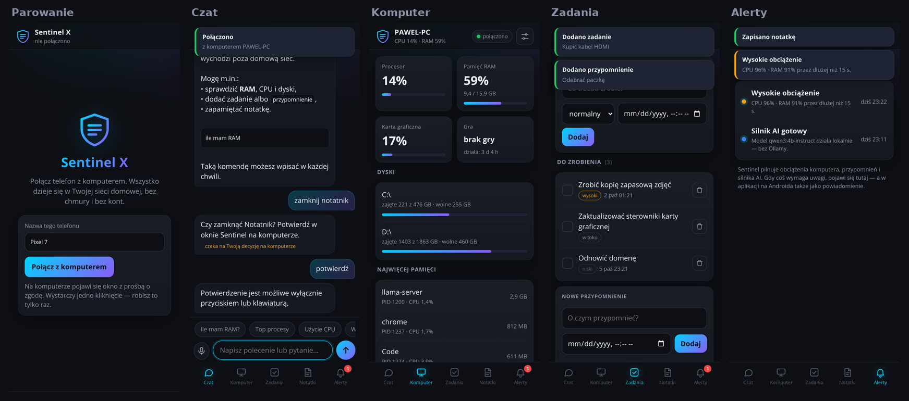

# Sentinel X 0.94 „AUTOPILOT” — notatki wydania

Data: 2026-09-30 · wersja aplikacji: `0.94 · AUTOPILOT` · Windows 10/11 x64, .NET 10 · aplikacja na Androida 7+

Zamówienie: **aplikacja na PC i na telefon, bez pilnowania żadnej funkcji, bez Ollamy, w postaci pliku .exe.**

## Co nowego

### Bez Ollamy: wbudowany silnik AI
Sentinel uruchamia `llama.cpp` (MIT) sam: pobiera, weryfikuje SHA-256, wybiera model do pamięci komputera (Qwen3 1,7B lub także 4B), startuje przy pytaniu
i zwalnia pamięć, gdy działa gra. Szczegóły: [ENGINE.md](ENGINE.md). Pakiet `OllamaSharp` usunięty; komunikaty „Uruchom Ollama” zastąpione opisem stanu silnika (postęp, „naprawi się sam”).

### Telefon: to samo co na komputerze

Aplikacja na Androida (`SentinelX-Phone-0.94.0.apk`) i strona dla przeglądarek/iPhone’a. Komputer serwuje je sam (HTTPS w sieci domowej),
telefon znajduje go bez wpisywania adresu, a parowanie to jedno kliknięcie **Zezwól** na komputerze z kodem potwierdzenia. Na telefonie: czat (odpowiedzi na żywo),
stan komputera, zadania i przypomnienia, notatki, alerty (+ powiadomienia w aplikacji), STOP awaryjny, głos po polsku, Wake-on-LAN. Protokół i bezpieczeństwo: [PHONE-LINK.md](PHONE-LINK.md).

### Autopilot
- Start z Windows w tle (`--autostart`: bez okna, tylko ikona w zasobniku). **Nowe domyślne:** autostart i Watch włączone. Dla istniejących ustawień autopilot włącza je **jeden raz** (flaga `Startup.AutopilotApplied`); potem decydujesz sam.
- `CareService` („opiekun”): co minutę sprawdza łącze z telefonem i silnik AI, uruchamia je ponownie, zamienia przypomnienia i problemy w alerty (PC + telefon) i pokazuje jedną linię: „Wszystko działa samo · … · ostatnia kontrola 12:30”.
- Komenda `telefon` (oraz **Telefon…** w zasobniku) pokazuje adres i kod QR.
- Instalator uruchamia aplikację po instalacji.

### Dystrybucja
Jedno wydanie na GitHubie zawiera: instalator `.exe`, wersję przenośną `.zip`, `SentinelX-Phone-<wersja>.apk`, sumy kontrolne. Budowanie: workflow **Release** (EXE na Windows, APK na Linuksie).
Plan B bez GitHub Actions: `scripts/build-local.ps1` (instalator EXE).

## Zmiany wewnętrzne
- Naprawiono kompilację na C# 14 / .NET 10 (`field` jest słowem kluczowym) i zaktualizowano CI do `net10.0-windows`.
- CI testuje **dokładnie to, co wydajemy** (samodzielna paczka z wbudowanym .NET i silnikiem, potem instalator), nie wersję zależną od zainstalowanego runtime. Oszczędniejszy: bez dublowania przez `pull_request`, bez dużych artefaktów.
- Nowe testy: `EngineRegression` (katalog, pobieranie z wznawianiem i odrzucaniem złego hasha, fasada, strumień, `keep_alive`, argumenty) i `LinkRegression` (prawdziwy TLS na loopback: przypinanie certyfikatu, parowanie i kod SAS, strumień czatu, zadania, notatki, long-poll alertów, odporność na śmieci). Test interfejsu telefonu w prawdziwej przeglądarce: `scripts/phone-mock`.

## Co zostało sprawdzone w CI, a czego nie

**Sprawdzone automatycznie (GitHub Actions, `windows-latest`/`ubuntu-latest`, wszystko zielone):**
kompilacja na .NET 10; silnik llama.cpp pobrany, zweryfikowany sumą SHA-256 i **uruchomiony** (`llama-server --version`); samodzielna paczka z silnikiem;
smoke UI wszystkich stron; `EngineRegression` i `LinkRegression` (prawdziwy TLS na loopback, przypinanie certyfikatu, parowanie z kodem potwierdzenia, token jednorazowy,
strumień czatu, zadania, notatki, long-poll alertów, odporność na śmieci, autopilot); dotychczasowa regresja; instalator i test **zainstalowanej** aplikacji (silnik jest w środku);
budowa i podpisanie APK. Interfejs telefonu dodatkowo przetestowano w prawdziwej przeglądarce (`scripts/phone-mock`).

**Nie sprawdzone (wymaga prawdziwych urządzeń):**
- prawdziwa generacja z modelem (modele mają gigabajty; CI ich nie pobiera),
- zapora Windows i prawdziwa sieć Wi‑Fi, wykrywanie telefonu, Wake-on-LAN,
- aplikacja na prawdziwym telefonie: instalacja APK, powiadomienia (Android 13+ pyta o zgodę), rozpoznawanie mowy,
- zachowanie Windows Defender/SmartScreen wobec niepodpisanych plików.

## Uczciwie o ograniczeniach
- Pliki nie są podpisane cyfrowo (SmartScreen, „instalacja z nieznanego źródła”).
- Telefon działa w sieci lokalnej; nie ma dostępu spoza domu bez własnej sieci prywatnej (np. Tailscale).
- Silnik AI działa na CPU (bez GPU); na słabym komputerze odpowiedzi są wolne, ale komendy systemowe działają natychmiast.
- Pierwsze pobranie modeli to 1,1 GB (+2,5 GB na mocniejszych komputerach) i wymaga internetu (można wyłączyć w Ustawieniach → AI).
